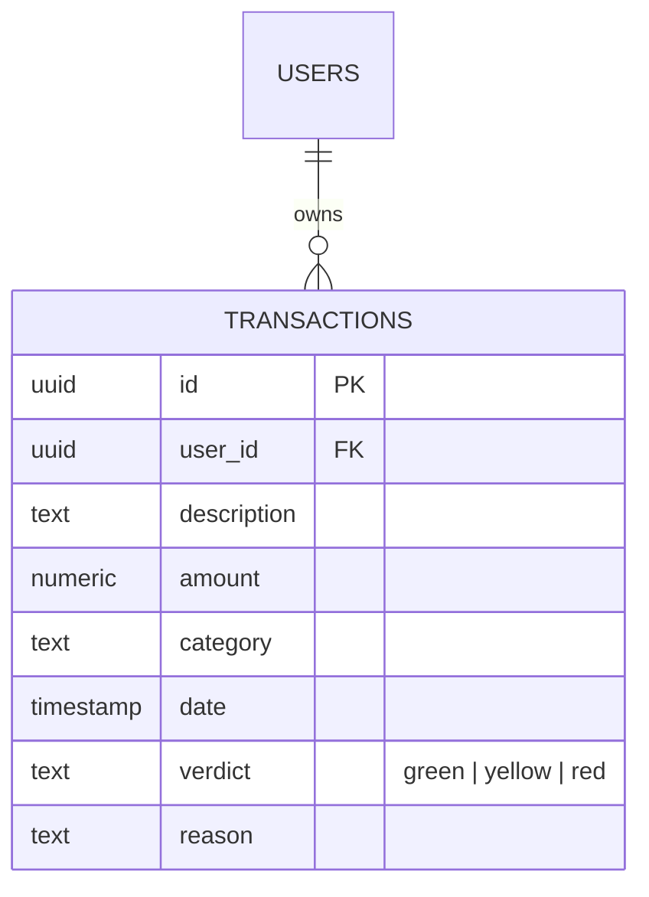

# 🚀 FinTrack-AI: Smart Financial Assistant

FinTrack-AI เป็นแอปพลิเคชันที่ใช้ AI (Gemini 2.0 Flash) ในการวิเคราะห์พฤติกรรมการใช้เงินรายวัน/สัปดาห์/เดือน/ปี พร้อมให้คำแนะนำเชิงรุกและการประเมินคะแนนสุขภาพทางการเงิน

---

## 🌐 Live Demo & Repository
- **Frontend (Vercel):** [https://fintrack-ai-nine-ruddy.vercel.app/](https://fintrack-ai-nine-ruddy.vercel.app/)
- **Backend API (Render):** [https://fintrack-backend-wnza.onrender.com](https://fintrack-backend-wnza.onrender.com)

--- 

## 🛠️ Tech Stack
- **Frontend:** Angular 17 (Signals, Tailwind CSS, Lucide Icons)
- **Backend:** Node.js, Express.js
- **AI Engine:** Google Gemini 2.0 Flash (Strict JSON Mode)
- **Database:** Supabase (PostgreSQL)
- **Authentication:** Google OAuth 2.0
## 📊 Database Schema (ER-Diagram)
- **auth.users**: ระบบสมาชิก (Google OAuth)
- **public.transactions**: เก็บข้อมูลรายรับ-รายจ่าย [id, user_id, amount, category, date, verdict, reason]
- **RLS Policy**: ป้องกันการเข้าถึงข้อมูลข้าม User 100%

## ⚙️ การตั้งค่าและรันโปรเจค (Installation & Setup)
1. การรัน Backend (Express.js)
Bash
cd backend && npm install && npm start

2. การรัน Frontend (Angular 17)
Bash
cd frontend && npm install && ng serve
---

## 🧪 Unit Testing & Quality
เพื่อให้ระบบมีความเสถียรระดับ Production เราได้เลือกใช้เครื่องมือทดสอบดังนี้:
- **Frontend**: ใช้ Jasmine/Karma ทดสอบการทำงานของ Auth Guard และ API Service (CRUD Operations)
- **Backend**: ใช้ Jest ทดสอบ Endpoint และการเชื่อมต่อกับ Gemini AI

---

## 🤖 AI Agent Prompts
โปรเจคนี้พัฒนาโดยการทำงานร่วมกับ AI Agent (Antigravity) ในระดับ Senior Full-Stack Engineer:

1. **Design**: "ช่วยออกแบบ Schema ฐานข้อมูลที่ AI สามารถนำไปวิเคราะห์ต่อได้ง่าย"
2. **Analysis**: "ทำหน้าที่เป็นที่ปรึกษาทางการเงิน วิเคราะห์รายการเหล่านี้ในรูปแบบ JSON"
3. **Troubleshooting**: "ช่วยวิเคราะห์ปัญหา 404 บน Production และเพิ่ม Log เพื่อไล่ Path Mismatch"

---

## 🚀 Deployment Status (Live Demo)
- **Frontend (Vercel)**: ใช้งานได้สมบูรณ์ พร้อมระบบ CRUD และ Auth
- **Backend (Render)**: รันระบบวิเคราะห์ AI แบบ Real-time
- **หมายเหตุ:** ปัจจุบันระบบ CRUD และ Auth ใช้งานได้สมบูรณ์ ส่วนระบบวิเคราะห์ AI (Button: Judge Me) ได้รับการปรับแต่งเป็น Explicit Routing เพื่อความเสถียรสูงสุดในสภาวะ Production

---
## 🚧 Challenges & Troubleshooting (ความท้าทายและการแก้ปัญหา)
ในระหว่างการ Deployment ระบบขึ้นสู่ Production พบปัญหาทางเทคนิคและได้ดำเนินการแก้ไขดังนี้:
**1. ปัญหา Vercel 404 (หน้าจอขาว) และ Angular 17 Output Directory
ปัญหา: หลังจาก Build สำเร็จ ระบบแสดงหน้าจอ 404 หรือหน้าขาวบน Vercel ทั้งที่ในเครื่อง Localhost รันได้ปกติ
สาเหตุ: Angular 17 มีการปรับเปลี่ยนโครงสร้างโฟลเดอร์ตอน Build โดยนำไฟล์ไปไว้ใน dist/[project-name]/browser ทำให้ Vercel หาไฟล์ index.html ไม่เจอ
การแก้ไข: แก้ไขโดยการ Override ค่า Output Directory ใน Vercel Dashboard ให้ตรงกับโครงสร้างจริง และกำหนด vercel.json เพื่อทำ Rewrites ทุก Request กลับไปยัง index.html เพื่อรองรับระบบ Routing ของ SPA (Single Page Application)
**2. ปัญหา Explicit Routing และ Middleware Ordering บน Render
ปัญหา: หน้าบ้านยิง Request ไปที่ /api/analyze-behavior แล้วติด Error 404 (Not Found) ทั้งที่ Backend ออนไลน์แล้ว
สาเหตุ: การลำดับ Middleware ใน Express.js (เช่น cors() และ json()) ไม่ครอบคลุมทุก Path และการทำ Nested Router ที่ซับซ้อนเกินไปจนระบบ Production งงเส้นทาง
การแก้ไข: ปรับปรุงโครงสร้างเป็น "Grip of Steel" โดยประกาศ Route แบบตายตัว (Explicit Path) และย้าย Middleware สำคัญไว้บนสุดของไฟล์ server.js เพื่อให้ระบบ Parse ข้อมูลได้อย่างถูกต้อง 100%
**3. Angular Bundle Budget Warning
ปัญหา: ระบบแจ้งเตือน initial exceeded maximum budget ระหว่างการ Build
สาเหตุ: การใช้งาน Library ประสิทธิภาพสูงพร้อมกัน (Gemini SDK, Supabase, Lucide) ทำให้ขนาดไฟล์เริ่มต้นใหญ่เกินค่าพื้นฐาน
การแก้ไข: ปรับปรุงการตั้งค่า budgets ใน angular.json และวางแผนการทำ Lazy Loading ในเฟสถัดไปเพื่อรักษาประสิทธิภาพการโหลดหน้าเว็บ
## 🤝 Contributor
- **Art Pannawat** (Lead Developer)
- **AI Assistant (Antigravity)** (Lead Architect & DevOps)
