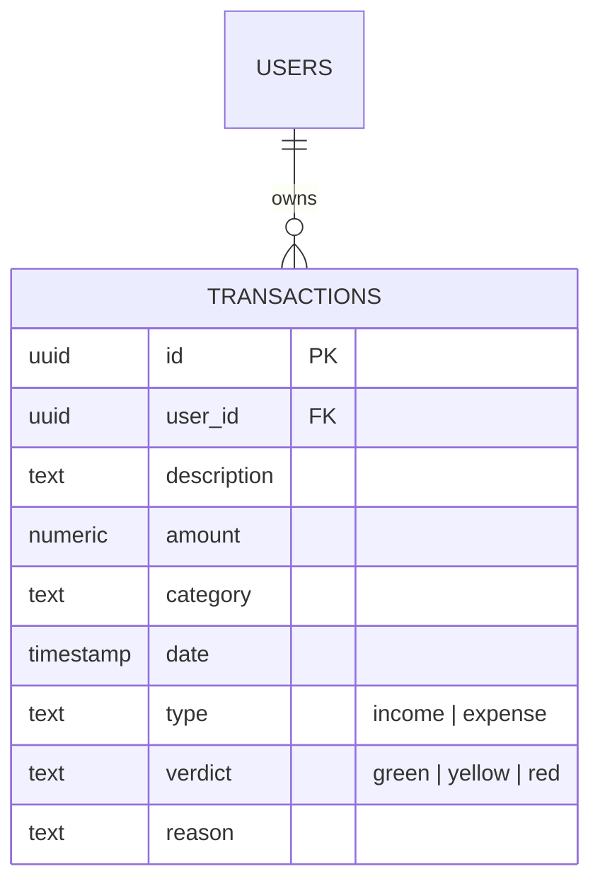

# 🚀 FinTrack-AI: Behavioral Financial Intelligence

FinTrack-AI ไม่ใช่แค่แอปบันทึกรายรับ-รายจ่ายทั่วไป แต่เป็น **ที่ปรึกษาการเงินอัจฉริยะ** ที่ใช้พลังของ **Gemini 2.0 Flash AI** ในการวิเคราะห์พฤติกรรมการใช้เงินของคุณแบบเรียลไทม์ พร้อมให้คำแนะนำแบบเจ็บแสบ (แต่หวังดี!) เพื่อช่วยให้คุณมีสุขภาพทางการเงินที่ดีขึ้น

---

## ✨ Key Features
- **🤖 AI Transaction Analysis**: วิเคราะห์ทุกรายการที่คุณบันทึก ให้คะแนน (Verdict) และเหตุผลกวนๆ
- **📊 Behavioral Intelligence**: วิเคราะห์ภาพรวมตามช่วงเวลา (รายวัน/สัปดาห์/เดือน/ปี) พร้อมคำนวณ **Financial Health Score (0-100)**
- **💎 Futuristic Glassmorphism UI**: ดีไซน์ล้ำสมัยด้วยระบบ Shimmer Loading และ Dashboard ที่เข้าใจง่าย
- **⚡ Real-time Sync**: ทำงานร่วมกับ Supabase เพื่อจัดเก็บข้อมูลอย่างปลอดภัยและรวดเร็ว
- **🛡️ Secure & Scalable**: มีระบบ Rate Limiting และ Fallback Wisdom เมื่อ AI ติดขัด

---

## 🛠 Tech Stack
- **Frontend**: Angular 21+, Signals, Lucide Icons, Chart.js
- **Backend**: Node.js, Express, ts-node
- **AI**: Google Gemini 2.0 Flash API
- **Database**: Supabase (PostgreSQL)
- **Deployment**: Vercel (Frontend), Render (Backend)

---

## 📐 Database Schema (ER-Diagram)

---

## 🧪 Quality Assurance & Testing
เพื่อให้ระบบมีความเสถียรระดับ Production เราได้เลือกใช้เครื่องมือทดสอบดังนี้:
- **Frontend (Jasmine/Karma)**: ทดสอบ Logic การคำนวณเงินใน Dashboard และการเชื่อมต่อ Supabase Service
- **Backend (Jest)**: ทดสอบ API Endpoints, CORS Policy และระบบ Rate Limiting
- **Validation**: ระบบตรวจสอบข้อมูล (Amount > 0) ทั้งฝั่ง Client และ Server

---

## 🧠 AI Prompt Engineering
เราใช้เทคนิค **Strict JSON Mode** ในการควบคุม Gemini AI เพื่อให้แน่ใจว่า:
1. การตอบกลับจะเป็น JSON String ที่ระบบสามารถนำไปประมวลผลต่อได้ทันที
2. ควบคุมความยาวและ Tone ของภาษาให้คงที่ (ปากร้ายแต่หวังดี)
3. มีระบบ **Static Wisdom Fallback** เพื่อรองรับกรณี API Quota เต็ม เพื่อให้ผู้ใช้ยังคงได้รับคำแนะนำอยู่เสมอ

---

## 🚀 Getting Started

1. **Clone Repo**: `git clone https://github.com/Artpannawat/Fintrack-AI.git`
2. **Install Deps**: `npm install` ทั้งในโฟลเดอร์ frontend และ backend
3. **Environment**: สร้างไฟล์ `.env` และกรอกค่าจาก `env.example`
4. **Run**:
   - Backend: `node server.js`
   - Frontend: `ng serve`

---

## 🤝 Contributor
- **Art Pannawat** (Lead Developer)
- **FinTrack-AI Coach** (AI Financial Advisor)
