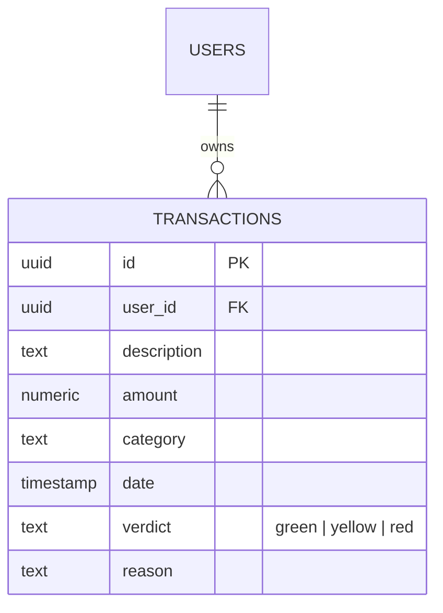

# 🚀 FinTrack-AI: Smart Financial Assistant
**Full-Stack AI Project for Intelligent Spending Behavior Analysis**

FinTrack-AI เป็นแอปพลิเคชันที่ใช้ AI (Gemini 2.0 Flash) ในการวิเคราะห์พฤติกรรมการใช้เงินรายวัน/สัปดาห์/เดือน/ปี พร้อมให้คำแนะนำเชิงรุกและการประเมินคะแนนสุขภาพทางการเงิน

---

## 🌐 Live Demo & Repository
- **Frontend (Vercel):** [https://fintrack-ai-nine-ruddy.vercel.app/](https://fintrack-ai-nine-ruddy.vercel.app/)
- **Backend API (Render):** [https://fintrack-backend-wnza.onrender.com](https://fintrack-backend-wnza.onrender.com)
- **GitHub:** [https://github.com/Artpannawat/Fintrack-AI](https://github.com/Artpannawat/Fintrack-AI)

---

## 🛠️ Tech Stack
- **Frontend:** Angular 21 (Signals, Lucide Icons, Chart.js)
- **Backend:** Node.js, Express.js (ts-node)
- **AI Engine:** Google Gemini 2.0 Flash (JSON Mode)
- **Database:** Supabase (PostgreSQL)
- **Authentication:** Google OAuth 2.0

---

## 📊 Database Schema (ER-Diagram)
ระบบถูกออกแบบมาให้รองรับผู้ใช้งานหลายคน (Multi-tenancy) พร้อมความปลอดภัยระดับ RLS:

---

## 🧪 Quality Assurance & Testing
เพื่อให้ระบบมีความเสถียรระดับ Production เราได้เลือกใช้เครื่องมือทดสอบดังนี้:
- **Frontend**: ใช้ Jasmine ทดสอบ `SupabaseService` (CRUD Operations & Auth Guard)
- **Backend**: ใช้ Jest ทดสอบ API Endpoints และระบบ Error Handling

---

## 🤖 AI Agent Prompts (ชุดคำสั่งที่ใช้จริง)
โปรเจคนี้พัฒนาโดยการทำงานร่วมกับ AI Agent (Antigravity) ในระดับ Senior Full-Stack Engineer:

- **Architecture Phase**: "ช่วยออกแบบโครงสร้างแอป Angular สำหรับบันทึกรายจ่าย เชื่อมต่อ Supabase และมีระบบ Login"
- **AI Integration Phase**: "สร้างระบบส่งข้อมูล Transaction ไปให้ Gemini 2.0 Flash วิเคราะห์พฤติกรรมและตอบกลับเป็น JSON พร้อมคำแนะนำกวนๆ"
- **Troubleshooting Phase**: "แก้ปัญหา 404 และ CORS บน Production โดยใช้ Catch-all Route เพื่อตรวจสอบ Path จริงที่ยิงมาจากหน้าบ้าน"

---

## ⚙️ การติดตั้งและรันระบบ
1. **Frontend**: `cd frontend && npm install && npm start`
2. **Backend**: `cd backend && npm install && node server.js`

---

## 🚀 Deployment Status & Challenges
- **Vercel**: ใช้ Deploy Frontend แบบ Serverless และจัดการ Routing สำหรับ Single Page Application
- **Render**: ใช้ Deploy Backend เพื่อรัน Node.js ตลอดเวลา พร้อมระบบ CI/CD จาก GitHub
- **Challenges**: พบปัญหา Path Mismatch (404) ในขั้นตอนสุดท้าย ซึ่งได้รับการแก้ไขโดยการทำ **Explicit Routing** และเพิ่มระบบ **Catch-all Logging** เพื่อตรวจสอบ Request จริงบน Server ในสภาวะ Production

---

## 🤝 Contributor
- **Art Pannawat** (Lead Developer)
- **AI Assistant (Antigravity)** (Lead Architect & DevOps)
