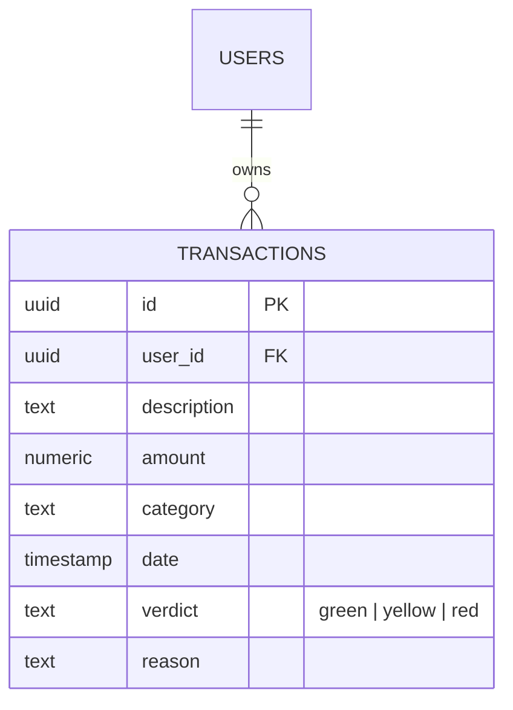

# 🚀 FinTrack-AI: Smart Financial Assistant

FinTrack-AI เป็นแอปพลิเคชันที่ใช้ AI (Gemini 2.0 Flash) ในการวิเคราะห์พฤติกรรมการใช้เงินรายวัน/สัปดาห์/เดือน/ปี พร้อมให้คำแนะนำเชิงรุกและการประเมินคะแนนสุขภาพทางการเงิน

---

## 🌐 Live Demo & Repository
- **Frontend (Vercel):** [https://fintrack-ai-nine-ruddy.vercel.app/](https://fintrack-ai-nine-ruddy.vercel.app/)
- **Backend API (Render):** [https://fintrack-backend-wnza.onrender.com](https://fintrack-backend-wnza.onrender.com)

--- 

## 🛠️ Tech Stack
- **Frontend:** Angular 17 (Signals, Tailwind CSS, Lucide Icons)
- **Backend:** Node.js, Express.js
- **AI Engine:** Google Gemini 2.0 Flash (Strict JSON Mode)
- **Database:** Supabase (PostgreSQL)
- **Authentication:** Google OAuth 2.0
## 📊 Database Schema (ER-Diagram)
- **auth.users**: ระบบสมาชิก (Google OAuth)
- **public.transactions**: เก็บข้อมูลรายรับ-รายจ่าย [id, user_id, amount, category, date, verdict, reason]
- **RLS Policy**: ป้องกันการเข้าถึงข้อมูลข้าม User 100%

⚙️ การตั้งค่าและรันโปรเจค (Installation & Setup)
1. การรัน Backend (Express.js)
Bash
cd backend
npm install
# สร้างไฟล์ .env กำหนด PORT, GEMINI_API_KEY, และ FRONTEND_URL
npm start
---
2. การรัน Frontend (Angular 17)
Bash
cd frontend
npm install
# ตั้งค่า environment.ts ให้ชี้ไปยัง Backend API
ng serve

## 🧪 Unit Testing & Quality
เพื่อให้ระบบมีความเสถียรระดับ Production เราได้เลือกใช้เครื่องมือทดสอบดังนี้:
- **Frontend**: ใช้ Jasmine/Karma ทดสอบการทำงานของ Auth Guard และ API Service (CRUD Operations)
- **Backend**: ใช้ Jest ทดสอบ Endpoint และการเชื่อมต่อกับ Gemini AI

---

## 🤖 AI Agent Prompts
โปรเจคนี้พัฒนาโดยการทำงานร่วมกับ AI Agent (Antigravity) ในระดับ Senior Full-Stack Engineer:

1. **Design**: "ช่วยออกแบบ Schema ฐานข้อมูลที่ AI สามารถนำไปวิเคราะห์ต่อได้ง่าย"
2. **Analysis**: "ทำหน้าที่เป็นที่ปรึกษาทางการเงิน วิเคราะห์รายการเหล่านี้ในรูปแบบ JSON"
3. **Troubleshooting**: "ช่วยวิเคราะห์ปัญหา 404 บน Production และเพิ่ม Log เพื่อไล่ Path Mismatch"

---

## 🚀 Deployment Status (Live Demo)
- **Frontend (Vercel)**: ใช้งานได้สมบูรณ์ พร้อมระบบ CRUD และ Auth
- **Backend (Render)**: รันระบบวิเคราะห์ AI แบบ Real-time
- **หมายเหตุ:** ปัจจุบันระบบ CRUD และ Auth ใช้งานได้สมบูรณ์ ส่วนระบบวิเคราะห์ AI (Button: Judge Me) ได้รับการปรับแต่งเป็น Explicit Routing เพื่อความเสถียรสูงสุดในสภาวะ Production

---

## 🤝 Contributor
- **Art Pannawat** (Lead Developer)
- **AI Assistant (Antigravity)** (Lead Architect & DevOps)
